***GUIA***

Utilitzant l'eina que heu seleccionat a la Fase 1 (Bitwarden, KeePassX, o similar), heu de crear una Guia d'Ús per a l'Equip Tècnic. Aquesta guia ha de ser clara i basada en captures de pantalla i instruccions pas a pas.

La guia ha de cobrir els següents punts obligatoris:

1. Instal·lació i Configuració Inicial: Descàrrega, instal·lació i creació de la BBDD principal o compte mestre.  
2. Generació de Contrasenyes Segures: Explicació de com utilitzar el generador de contrasenyes de l'eina (paràmetres, longitud, caràcters especials).  
3. Exemples d'Ús i Emplenament Automàtic:

   * Com desar una credencial d'un compte de correu electrònic.

   * Com desar una credencial d'una aplicació o servei web.

   * Com fer servir l’extensió del navegador per emplenar automàticament les dades.

4. Gestió de Còpies de Seguretat (Backup):

   * Explicació detallada de com fer una còpia de seguretat de l'arxiu de contrasenyes (KDBX en KeePass o Exportació en Bitwarden).  
   * Recomanació de la millor pràctica per emmagatzemar aquesta còpia de seguretat de forma segura (clau USB xifrada o emmagatzematge xifrat al núvol).

Comencem instal·lant la nostra eina, Bitwarden.
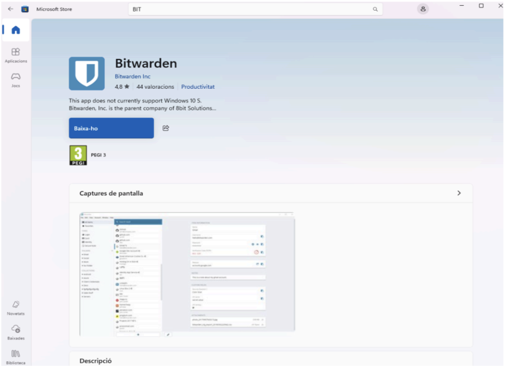

L'obrim.  
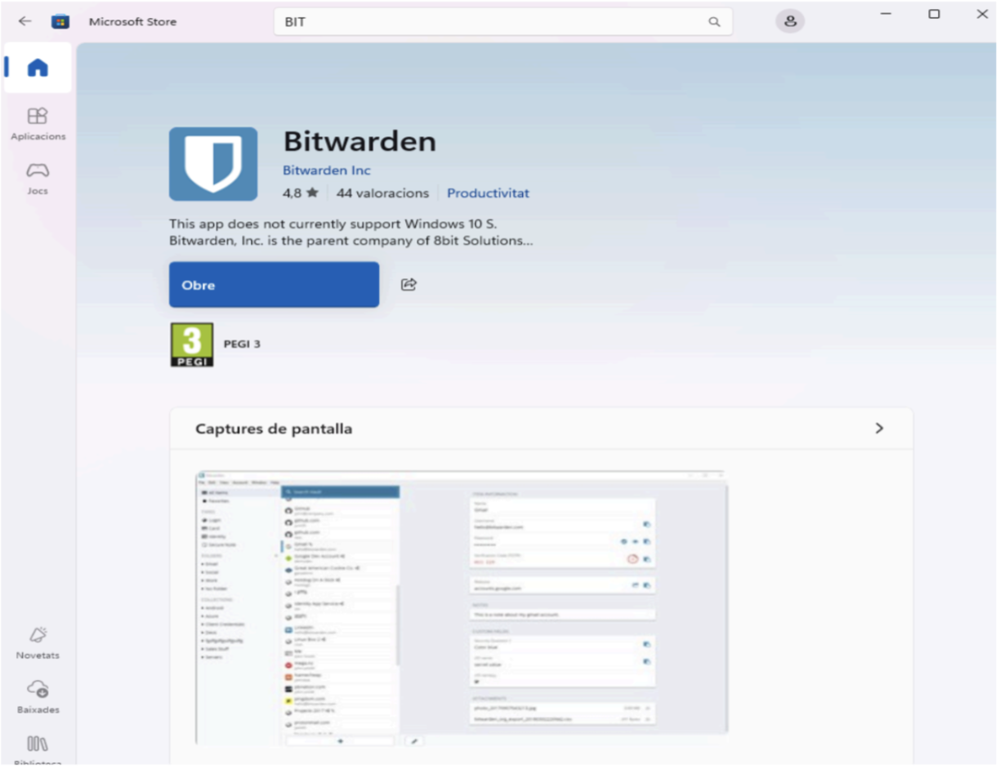

Una vegada a dins crearem el nostre nou compte.
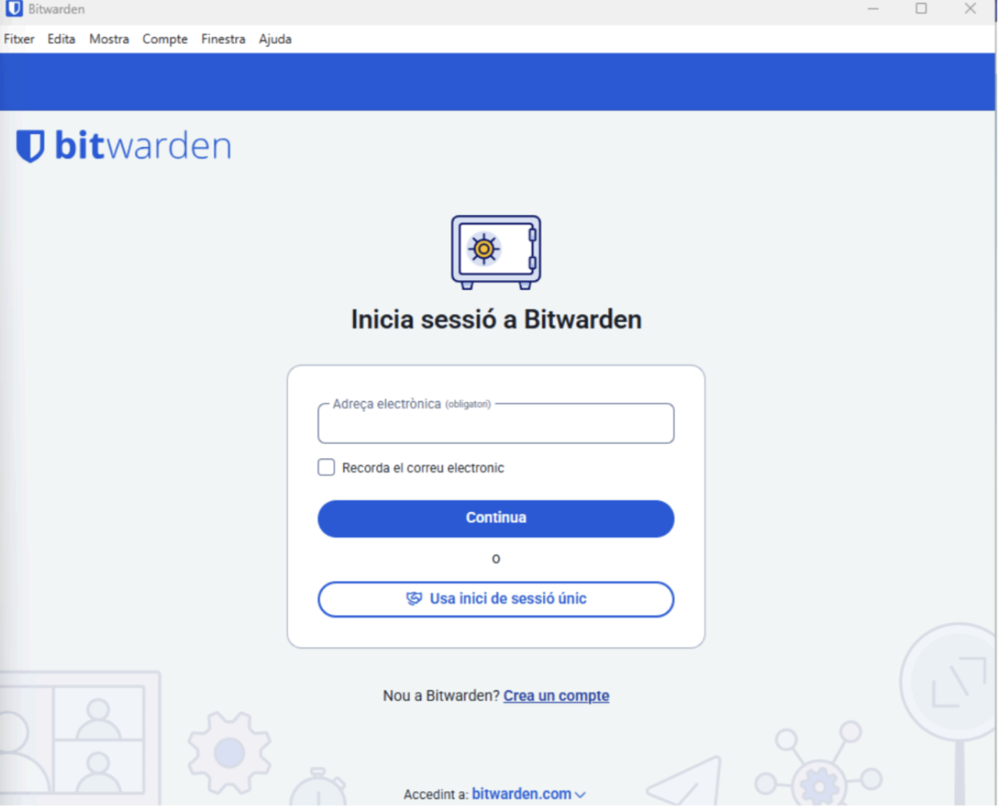

Primerament posem el nostre nom i correu
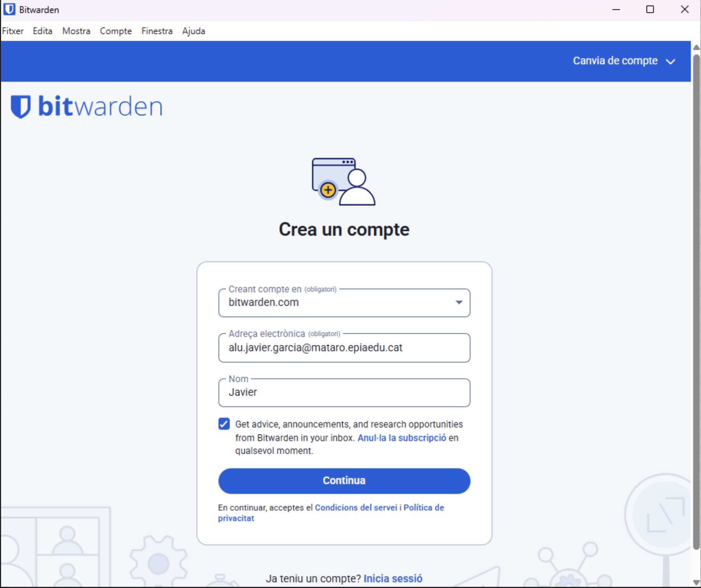

Fem la comprovació per poder continuar amb la creació del nou compte.
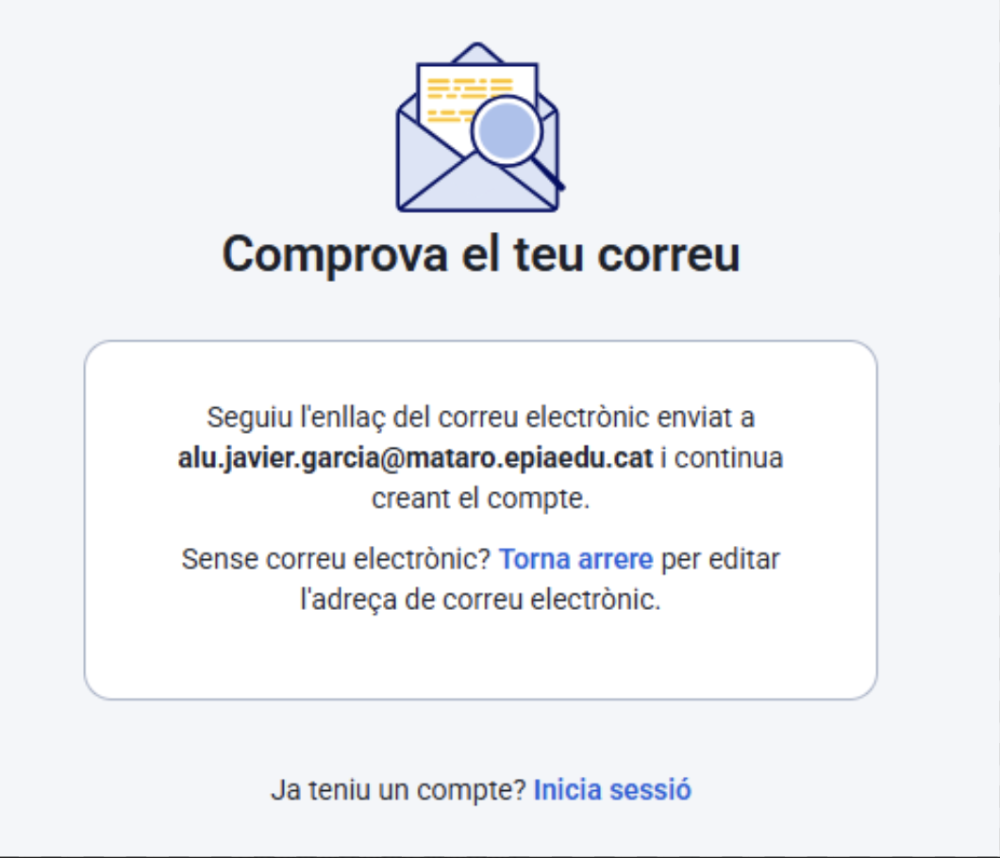

Posem una contrasenya difícil, com podria ser aquesta:

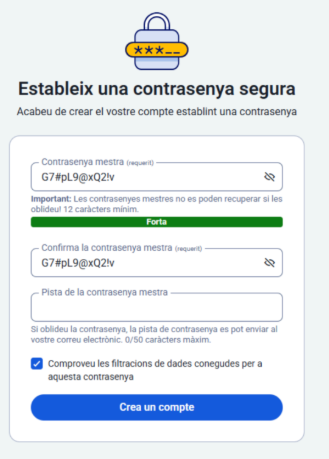

Ara ja tindrem el nostre compte nou creat i estarem dins.
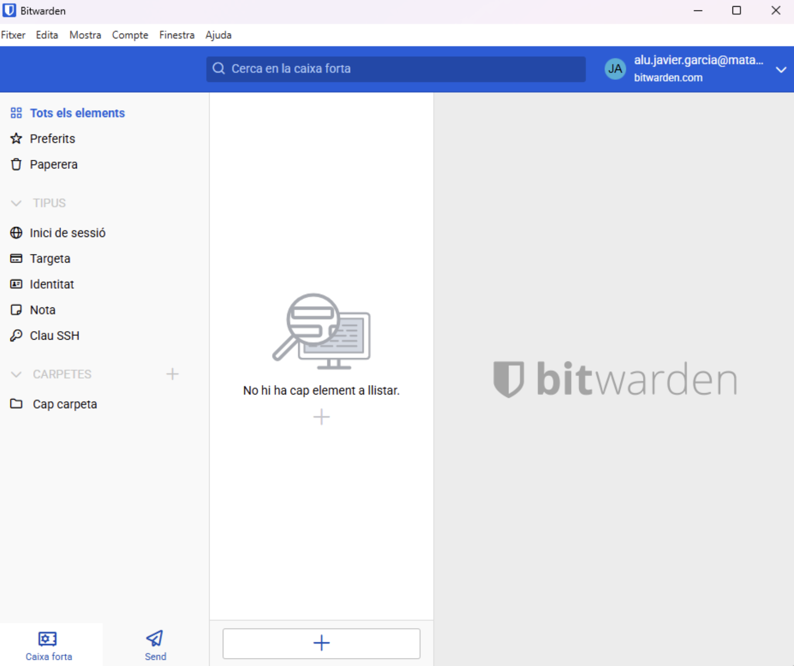

# **Part 2** 

1. ***Generació de Contrasenyes Segures: Explicació de com utilitzar el generador de contrasenyes de l'eina (paràmetres, longitud, caràcters especials).***

Per arribar aquí primer de tot hem d’anar a la part d’adalt on posa mostra i donar-li a generador i després posarem les configuracions que veiem a la imatge.

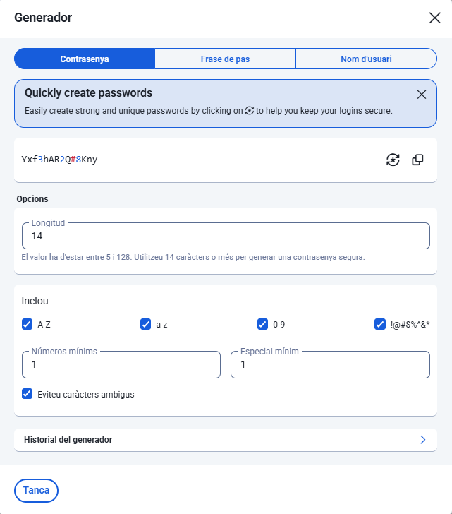

Li donem a Caixes fortes nou i inici de sessió, i posem les nostres dades.

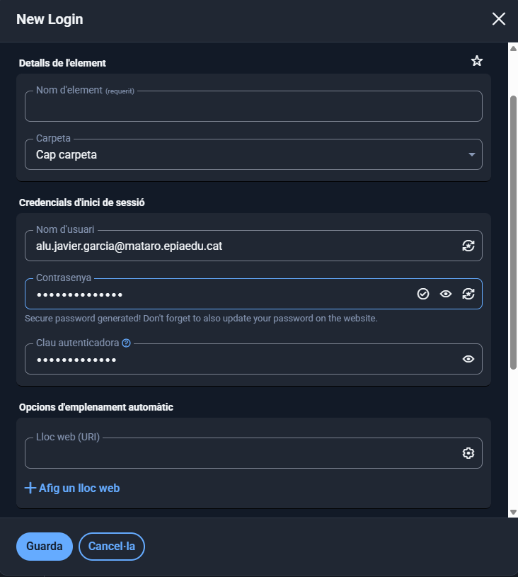

1. ***Exemples d'Ús i Emplenament Automàtic:***

Entrem desde una conta de gmail de casa afegir l'extensió de bitwarden iniciem sessió amb la compte que hem creat i busquem github iniciem sessió i et sortirà directament per poder-ho guardar al bitware como ho tinc jo.

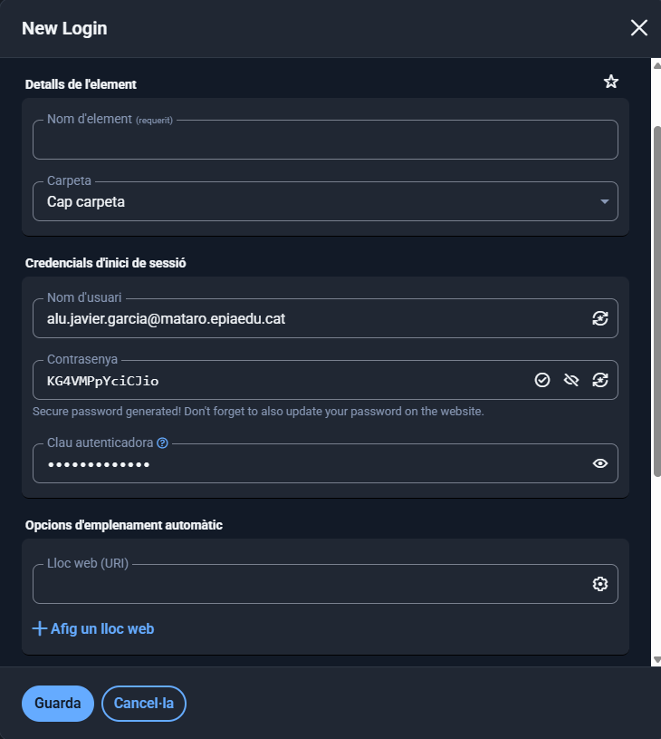

Per fer aquest punt nema gmail i en comptes d’iniciar sessió posant el mail li donem a l'opció que surt un cop dins posem el mail i la contrasenya i li donem a guardar així ja està per sempre.

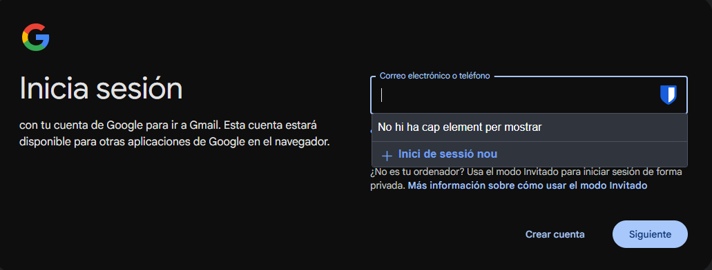

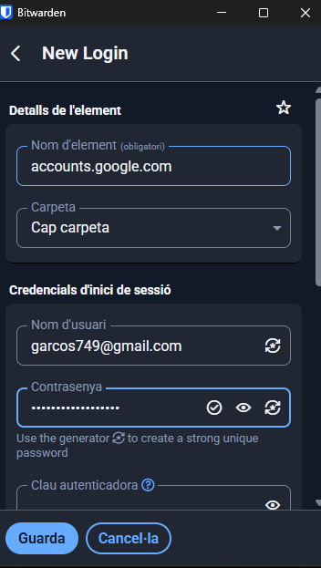

1. ***Gestió de Còpies de Seguretat (Backup):***

Li donem a eines i selecionem l'apartat exporta la caixa forta 
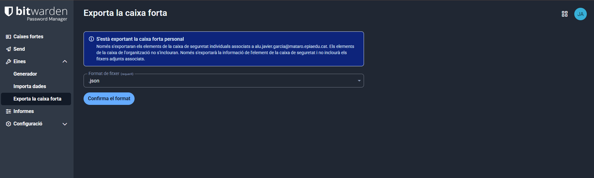
i confirmem el format

Possem la contrasenya que hem ficat abanç
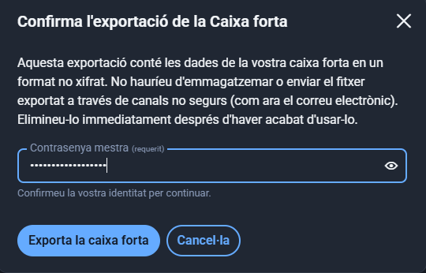

I l'exportem et tindria que quedar algo aixi 

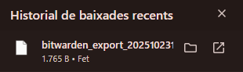

