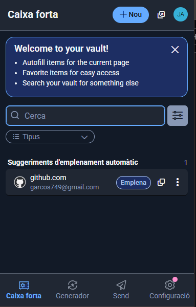

# 🧭 GUIA D'ÚS DE BITWARDEN

Utilitzant l'eina seleccionada a la **Fase 1** (**Bitwarden**, **KeePassX** o similar), heu de crear una **Guia d'Ús per a l'Equip Tècnic**.  
Aquesta guia ha de ser **clara**, amb **captures de pantalla** i **instruccions pas a pas**.

La guia ha de cobrir els següents punts obligatoris:

---

## 1. Instal·lació i Configuració Inicial

**Objectiu:** Aprendre a descarregar, instal·lar i crear la base de dades principal o compte mestre.

1. Comencem instal·lant la nostra eina, **Bitwarden**.  

    

3. L’obrim.  

    

4. Un cop dins, crearem el nostre nou compte.  

    

5. Primer de tot, introduïm el nostre **nom** i **correu electrònic**.  

    

6. Fem la **verificació** per poder continuar amb la creació del nou compte.  

    

7. Introduïm una **contrasenya segura**, com podria ser aquesta:  

   

8. Ara ja tindrem el nostre **compte creat** i estarem dins de Bitwarden.  

    

---

## 2. Generació de Contrasenyes Segures

**Objectiu:** Aprendre a utilitzar el generador de contrasenyes de l’eina (paràmetres, longitud, caràcters especials).

1. Per arribar-hi, primer anem a la part superior on posa **“Mostra”** i fem clic a **“Generador”**.
2. Configurem els paràmetres segons les nostres necessitats (longitud, caràcters especials, majúscules, etc.).  

   

3. Després, anem a **Caixes fortes → Nou inici de sessió** i introduïm les nostres dades.  

   

---

## 3. Exemples d’Ús i Emplenament Automàtic

**Objectiu:** Aprendre com desar credencials i utilitzar l’emplenament automàtic.

1. Entrem des d’un compte de **Gmail** a casa, afegim l’**extensió de Bitwarden** i iniciem sessió amb el compte creat anteriorment.
2. Busquem **GitHub**, iniciem sessió, i Bitwarden ens oferirà **desar les credencials automàticament**, com es veu a la imatge.  

    

4. Per fer aquest pas amb **Gmail**, en comptes d’introduir manualment el correu, fem servir l’opció de Bitwarden:  
   - Introduïm el correu i la contrasenya.  
   - Cliquem **“Desa al Bitwarden”**.  
   - A partir d’ara, les dades quedaran guardades de manera automàtica.  

     
   

---

## 4. Gestió de Còpies de Seguretat (Backup)

**Objectiu:** Aprendre com fer i guardar una còpia de seguretat de les contrasenyes de manera segura.

1. Anem a **Eines → Exporta la caixa forta**.  

    

3. Confirmem el **format d’exportació**.

4. Introduïm la **contrasenya mestra** per autoritzar l’exportació.  
 
   

5. Finalment, exportem la còpia. El resultat hauria de ser semblant a això:  

   

---

**Fi de la Guia d’Ús de Bitwarden**
