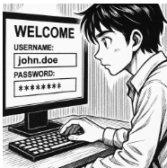

# **INFORME TÈCNIC**

**Consultora: EverPia** {#consultora:-everpia}

**Autor: Javier García** {#autor:-javier-garcía}

**Data: 21/10/2025** {#data:-21/10/2025}

---

**Índex**

[1\. Introducció i justificació	](#1.-introducció-i-justificació)

[2\. Comparativa tècnica de gestors de contrasenyes	](#2.-comparativa-tècnica-de-gestors-de-contrasenyes)

[Taula comparativa tècnica	](#taula-comparativa-tècnica)

[3\. Avantatges i inconvenients dels models	](#3.-avantatges-i-inconvenients-dels-models)

[3.1. Bitwarden (Online / Núvol)	](#3.1.-bitwarden-\(online-/-núvol\))

[3.2. KeePassXC (Offline / Local)	](#3.2.-keepassxc-\(offline-/-local\))

[4\. Recomanació final	](#4.-recomanació-final)

[5\. Conclusions	](#5.-conclusions)

[6\. Annexos recomanats	](#6.-annexos-recomanats)

---

## ***1\. Introducció i justificació*** {#1.-introducció-i-justificació}

La seguretat de la informació és molt important per a qualsevol empresa tecnològica. Les contrasenyes són la primera protecció contra accessos no autoritzats, i per això és essencial gestionar-les correctament per mantenir segurs els sistemes i les dades de l’empresa.

En els últims anys, molts ciberatacs s’han produït per culpa de contrasenyes febles o repetides. Els atacants poden aprofitar aquestes debilitats amb tècniques com els atacs de diccionari o el credential stuffing, que permeten entrar a comptes reutilitzant contrasenyes robades.

A EverPia, un cas així va provocar una bretxa de seguretat, després que un tècnic fes servir una contrasenya repetida. Per evitar que torni a passar, la Direcció Tècnica ha decidit implantar un gestor de contrasenyes per a tot el personal tècnic.

Aquest tipus d’eina permet guardar i crear contrasenyes segures i úniques, de manera que els treballadors no hagin de recordar-ne tantes i es redueixin els errors humans, millorant la seguretat general de l’empresa.

---

## ***2\. Comparativa tècnica de gestors de contrasenyes*** {#2.-comparativa-tècnica-de-gestors-de-contrasenyes}

S’han comparat dues opcions principals:  
 Bitwarden, com a alternativa en línia (núvol), i KeePassXC, com a solució local (offline).

### Taula comparativa tècnica {#taula-comparativa-tècnica}

| Característica | Bitwarden (Núvol) | KeePassXC (Local) |
| ----- | ----- | ----- |
| Tipus d’eina | Online | Offline |
| Model de seguretat | Xifratge E2E, 2FA | Xifratge AES-256, clau mestra |
| Emmagatzematge | Núvol de Bitwarden | Fitxer local KDBX |
| Sincronització | Automàtica entre dispositius | No disponible |
| Cost / Llicència | Freemium | Gratuït |
| Dependència d’Internet | Sí | No |

---

## ***3\. Avantatges i inconvenients dels models*** {#3.-avantatges-i-inconvenients-dels-models}

### 3.1. Bitwarden (Online / Núvol) {#3.1.-bitwarden-(online-/-núvol)}

**Avantatges**:

* Sincronització automàtica entre tots els dispositius (ordinador, mòbil, navegador).

* Interfície moderna, intuïtiva i fàcil d’utilitzar.

* Xifratge d’extrem a extrem (E2E): només l’usuari pot desxifrar les seves dades.

* Possibilitat d’activar autenticació multifactor (2FA).

* Còpies de seguretat automàtiques i sistema de recuperació segura.

* Compatible amb navegadors i plataformes mòbils (Android/iOS).

**Inconvenients:**

* Depèn d’una connexió a Internet.

* En entorns molt crítics, confiar en un proveïdor extern pot ser vist com un risc.

* Algunes funcions avançades (com compartir grups o auditories) requereixen la versió premium.

### **3.2. KeePassXC (Offline / Local)** {#3.2.-keepassxc-(offline-/-local)}

**Avantatges:**

* Total control sobre la base de dades i les credencials.

* Funciona sense connexió a Internet.

* Programari 100% gratuït i de codi obert.

* No depèn de cap servidor extern.

**Inconvenients:**

* No disposa de sincronització automàtica entre dispositius.

* Les còpies de seguretat s’han de fer manualment.

* Interfície menys intuïtiva i sense aplicació mòbil oficial.

---

## **4\. Recomanació final** {#4.-recomanació-final}

Després d’analitzar les dues alternatives, es recomana la implementació de Bitwarden com a gestor de contrasenyes corporatiu a EverPia.

Perquè?:

* **Seguretat i sincronització:** Bitwarden permet accedir a les credencials des de qualsevol dispositiu, essencial per a equips tècnics distribuïts o en teletreball.

* **Xifratge avançat i seguretat zero-knowledge:** totes les dades estan protegides amb xifratge d’extrem a extrem, i només l’usuari posseeix la clau per desxifrar-les.

* **Eficiencia operativa:** possibilita compartir credencials d’equip o projectes de manera segura.

* **Gestió centralitzada i còpies automàtiques:** garanteix la conservació de dades sense pèrdues.

* **Compatibilitat total:** funciona en navegadors, aplicacions d’escriptori i dispositius mòbils.

* **Autenticació de dos factors (2FA):** incrementa la seguretat dels comptes.

---

## **5\. Conclusions** {#5.-conclusions}

La implantació de Bitwarden com a gestor de contrasenyes corporatiu suposa un pas fonamental per millorar la seguretat i la productivitat a EverPia.

**Gràcies a aquesta eina, l’empresa:**

* Redueix dràsticament el risc d’ús de contrasenyes febles o repetides.

* Centralitza la gestió de credencials de manera segura i eficient.

* Millora la col·laboració entre equips tècnics amb credencials compartides de forma xifrada.

* Garanteix l’accés segur des de qualsevol dispositiu amb connexió a Internet.

En conclusió, Bitwarden ofereix una solució moderna, escalable i de confiança per garantir la seguretat de les credencials corporatives, reforçant la ciberseguretat d’EverPia i minimitzant els riscos de futures bretxes d’informació.

---

## **6\. Annexos recomanats** {#6.-annexos-recomanats}

* Fitxer d’instal·lació i informació oficial: [https://bitwarden.com](https://bitwarden.com/)

* Guia d’ús tècnica: *veure document guia.md*

* Referència: INCIBE – *Gestores de contraseñas*  
   [https://www.incibe.es/protege-tu-empresa/blog/gestores-de-contrasenas](https://www.incibe.es/protege-tu-empresa/blog/gestores-de-contrasenas)

