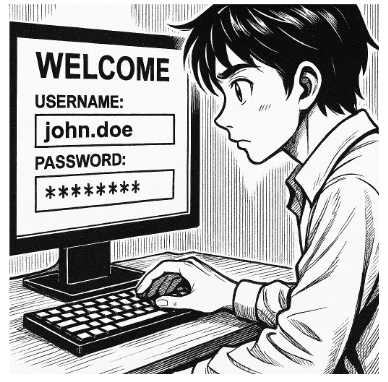

# 🔐 T01: Gestor de contrasenyes

## 🧾 Breu descripció

⚠️ **Alerta!! EverPia ha estat atacada per ciberdelinqüents.**  
La consultora on esteu de becaris ha patit una **fuita d’informació (data breach)** i dades confidencials sobre un projecte en desenvolupament han caigut en mans de delinqüents que amenacen amb publicar-les si no es paga un rescat.

Aquesta situació ha causat una **gran alarma dins la companyia**, i s’ha creat un **comitè de crisi** per gestionar l’incident.  
La investigació interna ha revelat que un dels comptes tècnics va ser compromès a causa de l’ús d’una **contrasenya feble o reutilitzada**.

Com a resposta, la Direcció Tècnica ha emès una directriu urgent:  
> Tot el personal tècnic ha de començar a utilitzar un **gestor de contrasenyes validat** per garantir l'ús de credencials úniques i robustes.

Se us encarrega la tasca d’**avaluar les opcions i crear la documentació necessària per formar el personal tècnic**.

---

## 🧠 Fase 1: Anàlisi i Justificació (Document d'Informe)

Heu de redactar un **informe tècnic** que justifiqui la decisió de la Direcció i compari les principals opcions de gestors de contrasenyes.

### Contingut obligatori de l’informe:

#### 1. Introducció i justificació
- Explicació de per què les **contrasenyes febles o reutilitzades** són un risc crític per a l’empresa (atac de diccionari, *credential stuffing*, etc.).
- La **funció crucial d’un gestor de contrasenyes** per mitigar aquests riscos.

#### 2. Comparativa tècnica
Realitzeu una taula comparativa entre:

| Eina | Tipus | Model de seguretat | Emmagatzematge | Accessibilitat | Cost / Llicència |
|------|--------|-------------------|----------------|----------------|------------------|
| **Bitwarden** | Online / Núvol | Xifratge E2E, autenticació de dos factors | Servidors al núvol | Multidispositiu | Freemium / Subscriptió |
| **KeePassX / KeePassXC** | Offline / Escriptori | Fitxer local KDBX, clau mestra | Local (USB, disc) | Manual | Gratuït / Open Source |

#### 3. Avantatges i inconvenients
Resumiu els **pros i contres** de cada model (online vs offline) tenint en compte:
- Seguretat i control de les dades.
- Usabilitat i facilitat d’adopció.
- Continuïtat del negoci i riscos operatius.

#### 4. Recomanació final
Escolliu l’eina més adequada per al personal tècnic d’EverPia i **justifiqueu la decisió** amb arguments tècnics (seguretat, eficiència, accessibilitat, manteniment, etc.).

---

## 🧩 Fase 2: Guia d'Ús Tècnica (Manual Operatiu)

Utilitzant l’eina seleccionada a la fase anterior (Bitwarden, KeePassXC o similar), creeu una **Guia d’Ús** per al personal tècnic.

### Contingut obligatori de la guia:

#### 1. Instal·lació i configuració inicial
- Descàrrega i instal·lació del programari.
- Creació de la base de dades principal o compte mestre.
- Activació de l’autenticació de dos factors (si escau).

#### 2. Generació de contrasenyes segures
- Com utilitzar el generador de contrasenyes.
- Paràmetres recomanats: longitud, majúscules, números i caràcters especials.

#### 3. Exemples pràctics d’ús
- Desar una credencial d’un compte de correu electrònic.  
- Desar una credencial d’una aplicació o servei web.  
- Utilitzar l’extensió del navegador per emplenar automàticament les dades d’inici de sessió.

#### 4. Gestió de còpies de seguretat (Backup)
- Com fer una còpia de seguretat de la base de dades (arxiu `.kdbx` o exportació).  
- Bones pràctiques per guardar còpies de manera segura:  
  - Clau USB xifrada.  
  - Emmagatzematge xifrat al núvol.  

---

