# T04: LDAP  

## 1️⃣ Creación de la máquina virtual

update the packages:

```bash
sudo apt update && sudo apt upgrade -y
```

Edita el archivo `/etc/hosts` to para definir el dominio:

```bash
sudo nano /etc/hosts
```

   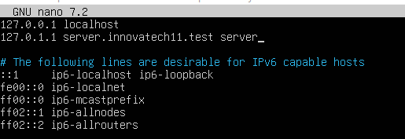

Verificamos que los cambios se han aplicado correctamente en el dominio.

   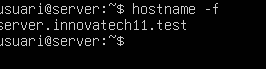

---

## 2️⃣ Configuración de red

Para permitir la comunicación con el anfitrión, configuramos una interfaz **Host-Only**:


Editaremos el archivo `/etc/netplan/50-cloud-init.yaml` con el siguiente pedido para habilitar la interfaz:

```bash
sudo nano /etc/netplan/50-cloud-init.yaml
```

   

Aplicamos los cambios y comprobamos la interfaz con `ip a`:

   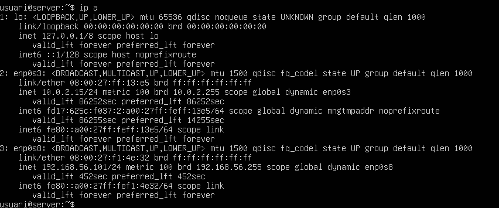

---

## 3️⃣ Instalación de OpenLDAP

Instalamos el servidor LDAP y las utilidades:

```bash
sudo apt install slapd ldap-utils -y
```

Durante la instalación, el sistema nos pedirá la contraseña del administrador. Introduciremos `p@ssw0rd`, tal y como se indica en el Pliego de Condiciones Técnicas.

   
   


Una vez ejecutado el pedido anterior, comprobaremos que el servicio se está ejecutando correctamente con el siguiente pedido:

```bash
sudo systemctl status slapd
```

   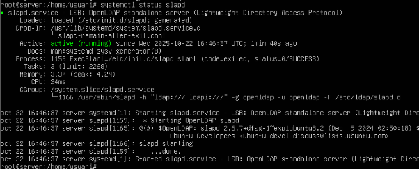

Ahora comprobaremos que el directorio se ha creado con el nombre deseado:

```bash
sudo slapcat
```

   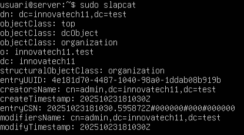

En caso de que el nombre del directorio no sea el correcto, deberemos reconfigurar el servicio con el siguiente pedido:

```bash
sudo dpkg-reconfigure slapd
```

---

## 4️⃣ Creación de unidades organizativas (OU)

Ahora deberemos crear dos unidades organizativas (*OUs*): **users** y **groups**, mediante un archivo `.ldif`.  

Para hacerlo, en mi caso he creado dos archivos, `OU_users.ldif` `OU_groups.ldif` con el siguiente pedido:

```bash
sudo nano OU_users.ldif
```

Dentro del archivo añadiremos el siguiente contenido:

```ldif
dn: ou=users,dc=innovatech11,dc=test
ou: users
objectClass: top
objectClass: organizationalUnit

dn: ou=groups,dc=innovatech11,dc=test
ou: groups
objectClass: top
objectClass: organizationalUnit
```

   
  
   


Para crear finalmente las OUs, ejecutaremos el siguiente comando:

```bash
sudo ldapadd -D "cn=admin,dc=innovatech11,dc=test" -W -f OU_users.ldif
```

Para comprobar que se ha hecho correctamente pondremos el siguiente pedido:

```bash
ldapsearch -xLLL -b "dc=innovatech11,dc=test"
```

   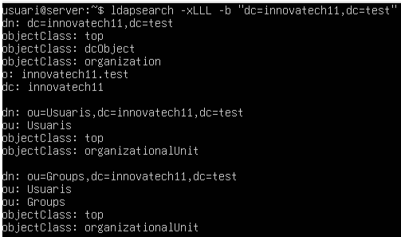

---

## 5️⃣ Instalación del gestor LDAP (LAM)

Puesto que administrar el servidor de dominio desde la línea de mandatos puede resultar complejo, es recomendable utilizar un gestor de usuarios LDAP como **LDAP Account Manager (LAM)**.

Para instalarlo, ejecutaremos el siguiente comando (el parámetro `-y` evita que aparezcan mensajes de confirmación durante la instalación):

 

```
http://IP_DEL_SERVER/lam
```

Una vez dentro, accederemos a **Edit server profiles** para empezar la configuración del perfil del servidor.
 

En este apartado configuraremos las opciones generales del gestor, como el idioma, la cuenta de administrador y otros parámetros básicos.

   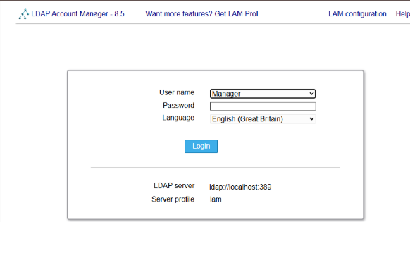

 

En la segunda pestaña **Account Types**, definiremos los **DN** de los usuarios y de los grupos, incluyendo una **OU** para los usuarios y otra para los grupos.

   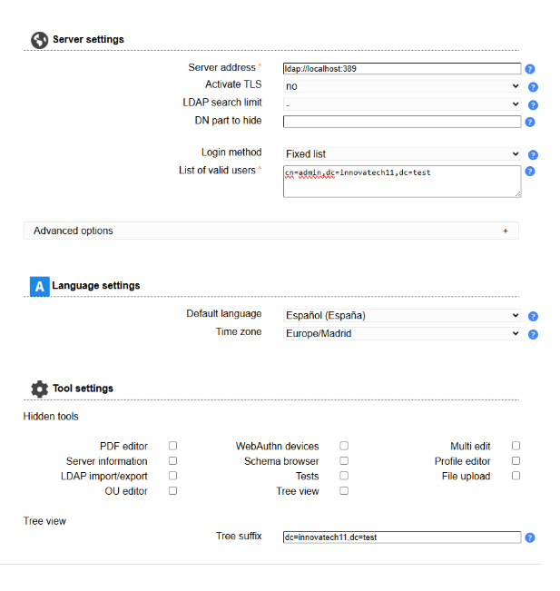

---

## 6️⃣ Creación de grupos y usuarios

### Grupos

Una vez dentro del panel de administración, debemos crear dos **grupos de seguridad** en el directorio: `tech` y `manager`.  

Para ello, iremos a **Accounts → Groups**.

Una vez dentro de este apartado, haremos clic en **New group** para crear ambos grupos.

   

Después de configurarlos, pulsamos **Save** para guardar los cambios.

Por último, ya tenemos creados los dos grupos en el directorio.

   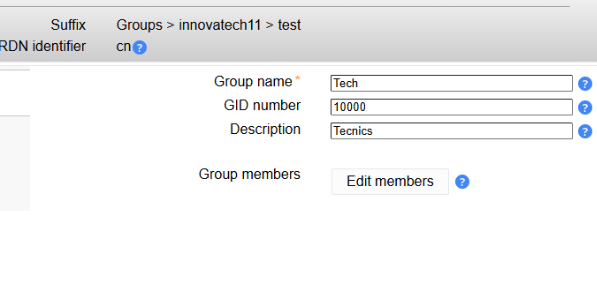

### Usuarios

Repetiremos el mismo proceso para crear un usuario para cada grupo, llamados `tech01` y `manager01`.  

Para ello, nos dirigiremos a **Accounts → Users** y haremos clic en **New user**.

En el interior del formulario deberemos introducir la información personal del usuario, como la dirección, el teléfono, la fotografía y otros datos básicos.

   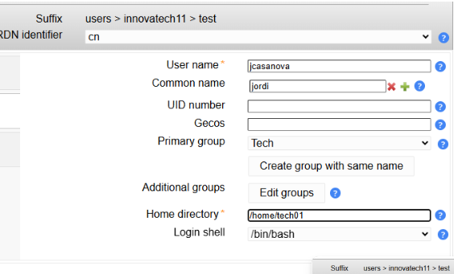

También configuraremos la información **Unix**, necesaria para que el usuario pueda iniciar sesión en el cliente.

   

En este paso, deberemos crear el **grupo primario** con el mismo nombre que el usuario.

   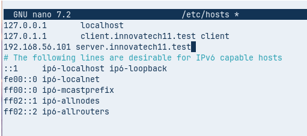

Deberemos añadir el usuario al **grupo correspondiente**.  

Para ello, haremos clic en el botón **Edit groups** y, una vez dentro, moveremos el grupo `tech` (en este caso) en la sección **Selected groups** para asignarlo correctamente al usuario.

Por último, deberemos crear una **contraseña** para que el usuario de dominio pueda iniciar sesión.  

Para ello, haremos clic en el botón **Set password**, introduciremos la contraseña `1234` y marcaremos la casilla que obliga al usuario a cambiarla en el **primer inicio de sesión**.

   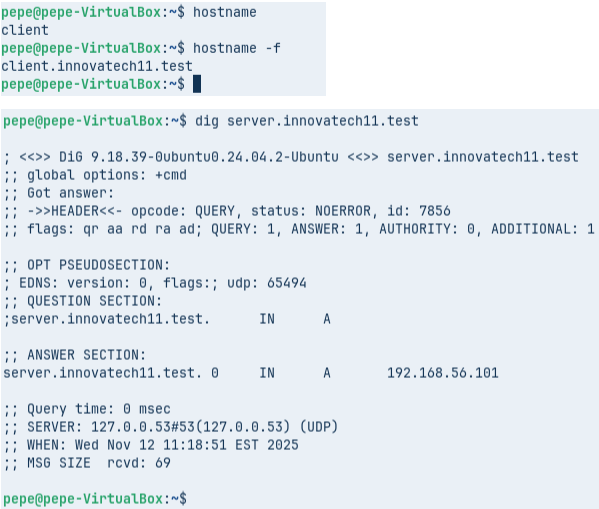

Una vez completados estos pasos, guardaremos al nuevo usuario haciendo clic en el botón **Save**.  

A continuación, repetiremos el mismo proceso con el usuario y el grupo `manager01`, obteniendo el siguiente resultado:

   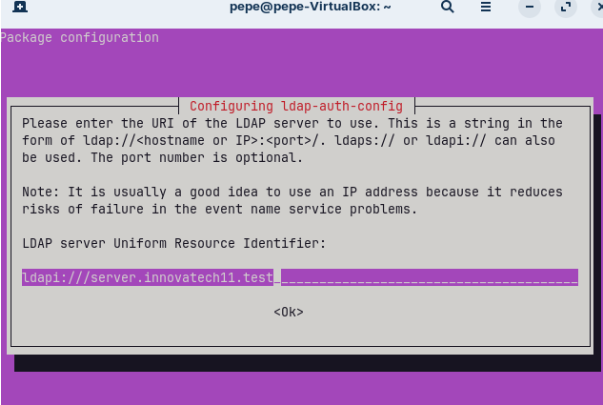

---

## 7️⃣ Configuración del cliente (ZorinOS)

Para comprobar que el servidor **LDAP** funciona correctamente, configuraremos un **cliente ZorinOS**.  

A este cliente le crearemos una **segunda interfaz de red** en modo **host-only**, para que pueda comunicarse con el servidor.

Una vez dentro del cliente, deberemos **configurar el nombre del equipo** para que forme parte del mismo dominio que el servidor.

Como no disponemos de un servicio **DNS**, editaremos el archivo `/etc/hosts` del cliente para que pueda resolver el nombre del servidor correctamente.

   

Ahora comprobaremos que los nombres se resuelven correctamente ejecutando los siguientes pedidos:

### Verificar el nombre de host del cliente

Para asegurarnos de que el nombre del equipo se ha cambiado correctamente:

```bash
hostname -f
```

### Comprobar la resolución del servidor de dominio

Para verificar que la resolución DNS hacia el servidor de dominio es correcta:

```bash
dig server.innovatech26.test
```

   

### Instalación de los módulos de autenticación LDAP

Para poder utilizar el cliente dentro del dominio, debemos instalar los **módulos necesarios** con el siguiente pedido:

```bash
sudo apt install libnss-ldap libpam-ldap ldap-utils nscd -y
```

A continuación, se iniciará el proceso de configuración de los **módulos de autenticación**.


   
   
   
   
   
   

Para comprobar la conectividad con el servidor, haremos una consulta **ldapsearch** desde el cliente con el siguiente pedido:

```bash
ldapsearch -x -D "cn=admin,dc=innovatech26,dc=test" -W -H ldap://server.innovatech26.test -b "dc=innovatech26,dc=test" objectClass=posixAccount uid
```

   

---

## 8️⃣ Integración PAM y NSS

Ahora configuraremos el archivo `nsswitch.conf` para indicar que se utilizará **LDAP** para la gestión de usuarios y grupos.

```bash
sudo nano /etc/nsswitch.conf
```

   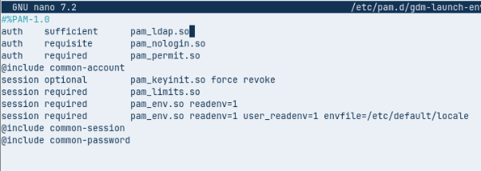

En el archivo `/etc/pam.d/common-password`, eliminaremos la línea que contenga el término `use_authok`.

   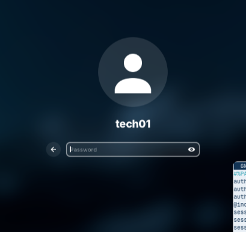

En el archivo `/etc/pam.d/common-session`, añadiremos la siguiente línea para permitir la **creación automática de los perfiles de usuario**:

   

Ahora reiniciaremos el servicio con el siguiente pedido:

```bash
sudo systemctl restart nscd
```

Una vez que el servicio se haya reiniciado, comprobaremos que detecta correctamente los usuarios **LDAP** con este pedido:

```bash
getent passwd | tail
```

Podemos verificar que el sistema muestra correctamente a los usuarios provenientes del directorio **LDAP**.
   

## 9️⃣ Inicio de sesión gráfica

Para finalizar, editaremos el archivo `/etc/pam.d/gdm-launch-environment` para permitir el inicio de sesión gráfica de los usuarios del dominio.

   

Reiniciaremos el cliente y, en la pantalla de inicio de sesión, haremos clic en **Not listed** para introducir manualmente otro usuario.

   

A continuación, introduciremos el usuario `tech01` para iniciar sesión con las siguientes credenciales:

- **Usuario:** `tech01`
- **Contraseña:** `1234`

   

Después de introducir la contraseña, aparecerá un mensaje indicando que se está creando el **directorio personal** del usuario, en este caso `/home/tech01`.

Una vez iniciada la sesión, se puede comprobar que todo se ha creado correctamente.

   


[Tornar a enunciat](README.MD)
