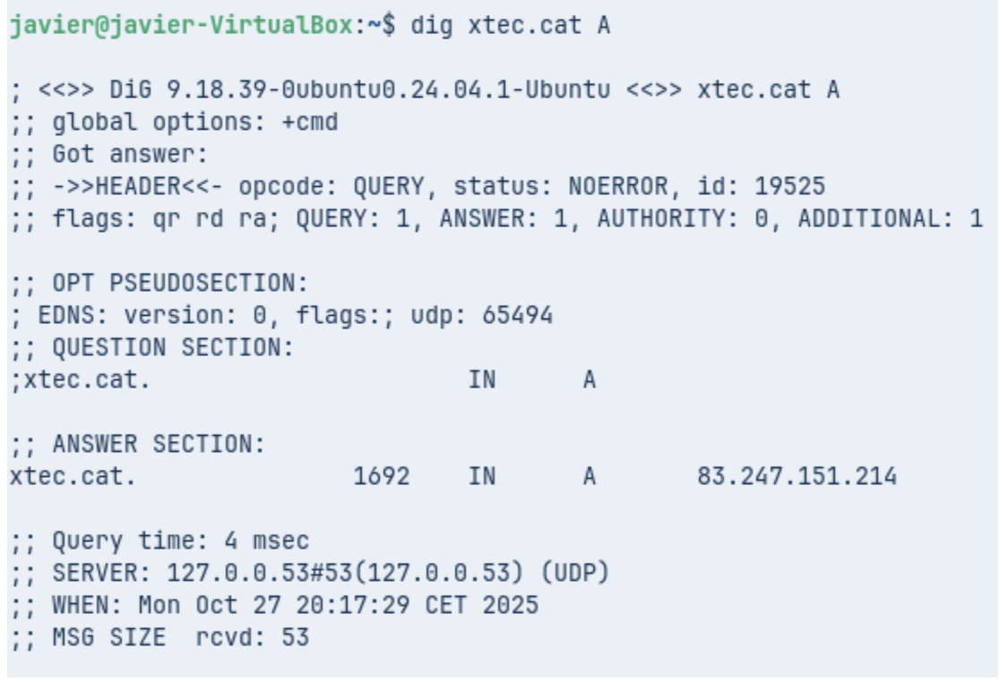
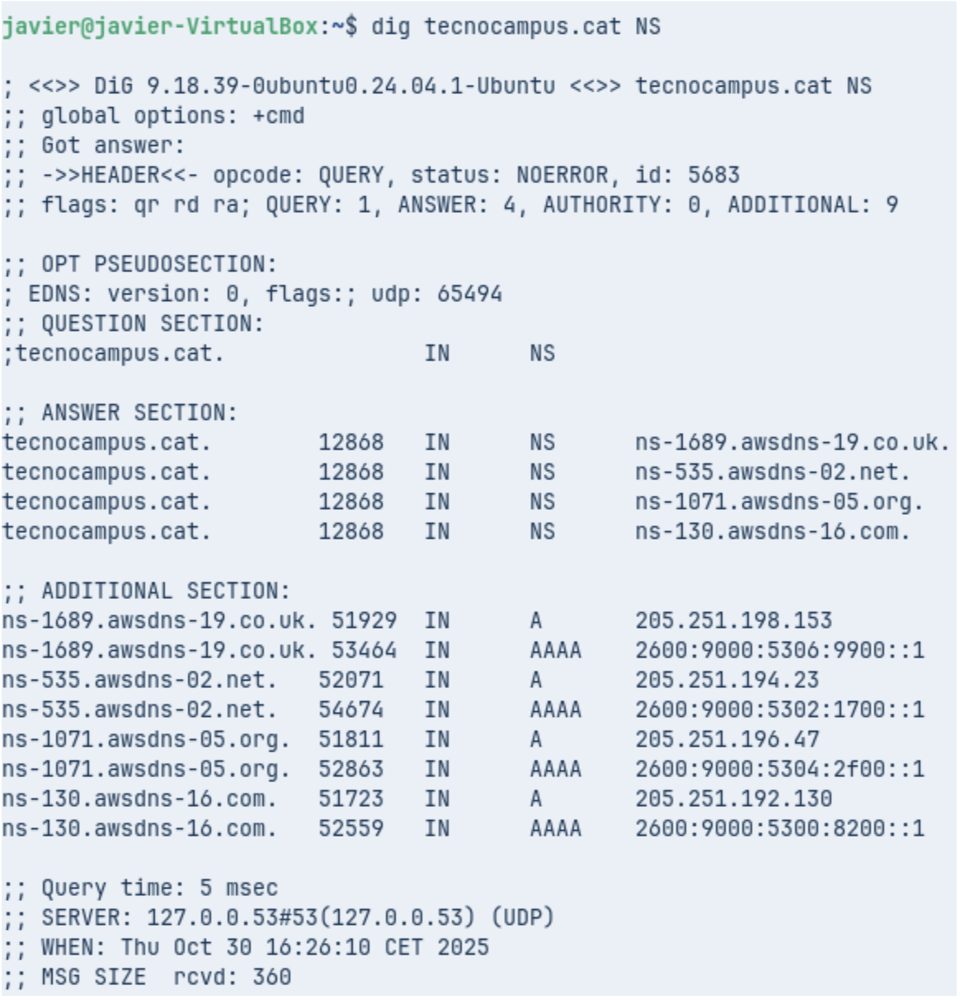
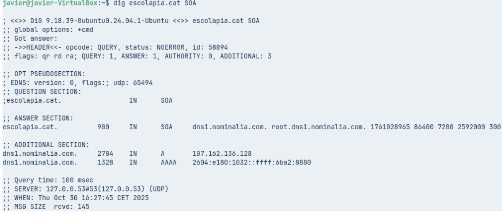
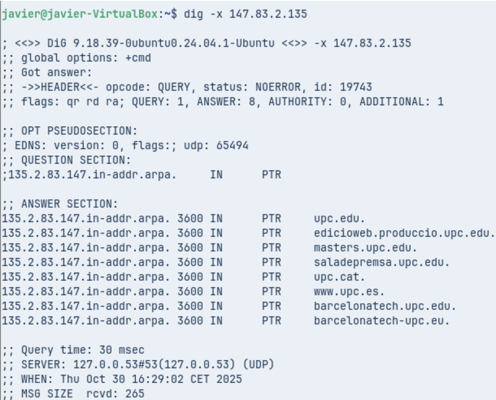
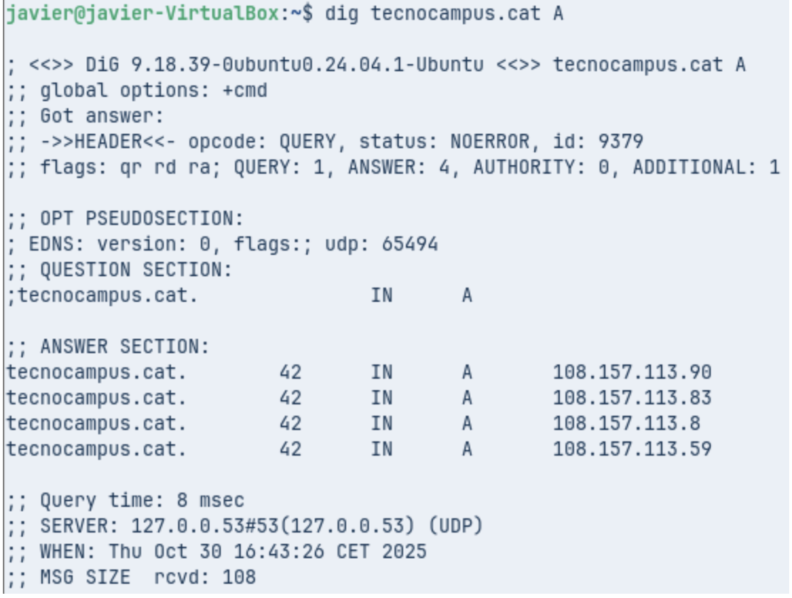
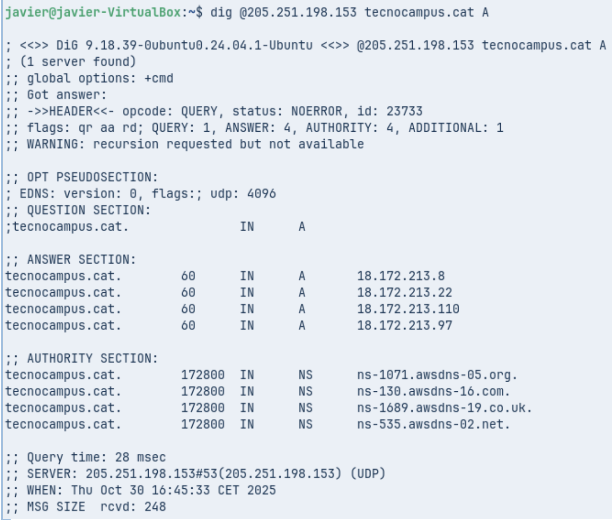

***Comanda 1: Consulta Bàsica de Registre A***

***Anàlisi: Identifica la IP de resposta, el valor TTL i el servidor que ha respost a la consulta.***

IP de resposta (adreça associada al domini `xtec.cat`): `83.247.151.214`

Valor TTL (Time To Live): `1692` segons

Servidor que ha respost a la consulta: `127.0.0.53`
---

***Comanda 2: Consulta de Servidors de Noms (NS)***

***Anàlisi: Quins són els servidors de noms autoritatius per a aquest domini?***

1. ns-1689.awsdns-19.co.uk.

2. ns-535.awsdns-02.net.

3. ns-1071.awsdns-05.org.

4. ns-130.awsdns-16.com.
---

***Comanda 3: Consulta Detallada SOA***

***Anàlisi: Quina és la informació del correu de l'administrador i el número de sèrie del domini?***

Correu de l’administrador: root@dns1.nominalia.com

Número de sèrie: 1761028965
---

***Comanda 4: Consulta resolució inversa***

***Anàlisi: Quina informació sobre els registres s’obté?***

La IP 147.83.2.135 està associada als dominis:  
upc.edu,edicioweb.produccio.upc.edu,masters.upc.edu,saladepremsa.upc.edu,upc.cat, www.upc.es, barcelonatech.upc.edu, i [barcelonatech-upc.eu](http://barcelonatech-upc.eu).
---

**Comanda 1: Consulta Bàsica no Autoritativa**

**Anàlisi: Per què indica que la resposta és no autoritativa?**

Perquè la resposta prové d’un servidor DNS de caché (127.0.0.53) i no del servidor autoritatiu del domini.
---

**Comanda 2: Consultes autoritatives**

**Anàlisi: Quines diferències s’observen a la resposta obtinguda amb la comanda 1?**

Aquesta resposta és autoritativa, a diferència de la comanda 1\.  
Perquè ve del servidor autoritatiu (205.251.198.153) i mostra la marca “aa” i una AUTHORITY SECTION amb els servidors del domini.
